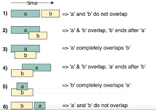

# Pattern 4 : Merge Intervals
This pattern describes an efficient technique to deal with overlapping intervals. In a lot of problems involving intervals, we either need to find overlapping intervals or merge intervals if they overlap.

Given two intervals (`a` and `b`), there will be six different ways the two intervals can relate to each other:
1. `a` and `b`do not overlap
2. `a` and `b` overlap, `b` ends after `a`
3. `a` completely overlaps `b`
4. `a` and `b` overlap, `a` ends after `b`
5. `b` completly overlaps `a`
6. `a` and `b` do not overlap

Understanding the above six cases will help us in solving all intervals related problems.

